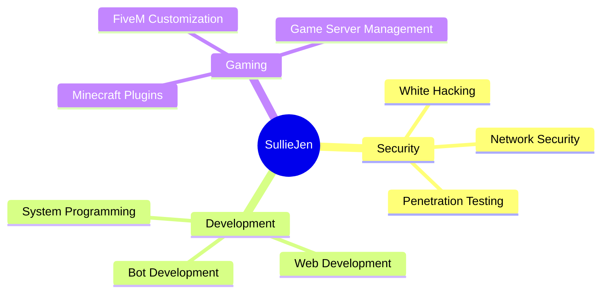

<div align="center">
  
  
  
</div>

---

## 🚀 About Me
```python
class SullieJen:
    def __init__(self):
        self.name = "SullieJen"
        self.role = "Student & Developer"
        self.MBTI = "ISFP"
        self.languages = ["Python", "C", "C++", "SQL", "HTML", "JavaScript"]
        self.systems = ["Linux"]
        self.interests = [
            "Security Expert",
            "White Hacker",
            "System Programming", 
            "Web Development", 
            "Database Design"
        ]
        
    def say_hi(self):
        print("Thanks for dropping by! Let's build something amazing together! 🚀")

me = SullieJen()
me.say_hi()
```

---

## 💼 Current Projects

<div align="center">

<table>
<tr>
<td align="center" width="25%">

<br><b>마크 플러그인 개발</b>
<br><sub>Minecraft Plugin Dev</sub>
</td>
<td align="center" width="25%">

<br><b>FIVEM 차량 제작</b>
<br><sub>Vehicle Modeling & Custom</sub>
</td>
<td align="center" width="25%">

<br><b>디스코드 봇 개발</b>
<br><sub>Discord Bot Development</sub>
</td>
<td align="center" width="25%">

<br><b>웹 사이트 개발</b>
<br><sub>Website Development</sub>
</td>
</tr>
</table>

</div>

---

## 🛠️ Tech Stack

<div align="center">

### Programming Languages


### Database & Systems


### Development Tools


### Security & Network


</div>

---

<div align="center">
  
  ### 💭 이번달의 명언

  *"「느린 것을 두려워하지 말고, 멈추는 것을 두려워하라.」"*
  
  ---
  
  ### 🎯 Focus Areas

  
---
  
<a href="https://giphy.com/gifs/7sQcUntHVodrmyXRW0">
  
</a>

---

### 📫 Connect With Me

<div align="center">

[](mailto:legendliqp123@gmail.com)
[](https://github.com/sulliejen)
[](https://discord.com)

</div>

---


  ⭐️ From [SullieJen](https://github.com/sulliejen)
  

---
